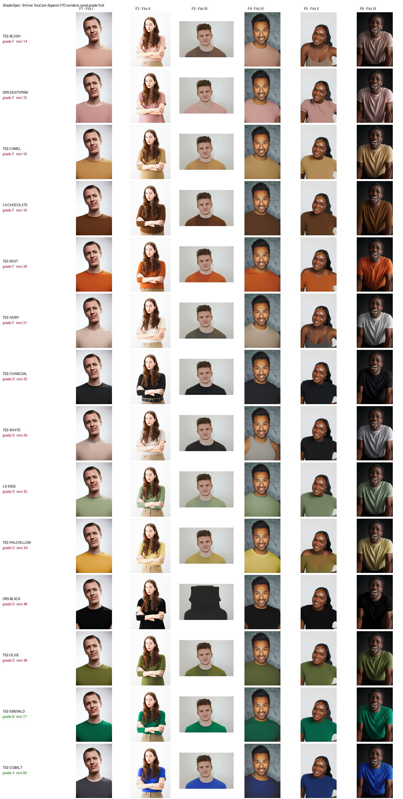

# ShadeSpan

**Catalog inclusivity audits for fashion e-commerce.** Render every garment on every skin tone with YouCam Apparel VTO, score how each color actually reads on each tone, and hand the merch team a report they can act on before the season ships.

Built for the YouCam API Skin AI & Apparel VTO Hackathon (2026).



## The problem

Most catalogs photograph each garment on one model. Shoppers on the other five Fitzpatrick tones are left guessing, and the guess is expensive: a beige tee that vanishes against fair skin, a pale yellow that reads washed-out on deep skin, a camel that turns invisible on the exact tone it matches. The shopper either never clicks, or clicks and returns it. Brands rarely find out which garments are doing this, because nobody renders the full garment-by-tone grid before launch.

ShadeSpan renders that grid. Then it grades it.

## What it does

1. Takes a catalog (product photos plus metadata) and a six-model skin-tone panel spanning Fitzpatrick I to VI.
2. Renders every garment on every panel member through **YouCam Apparel VTO**, with caching so nothing is ever rendered twice.
3. Scores every cell with deterministic color science: WCAG luminance contrast, chromatic edge contrast, CIEDE2000 separation between garment and skin, chroma, plus a washout gate for near-skin neutrals. No model opinions. Every number traces to a formula in `scoring/metrics.py`.
4. Checks each render against its catalog swatch and flags cells where the try-on did not produce the color that was asked for.
5. Grades each garment on its **worst** tone, because averages hide exactly the customers this tool exists to protect.
6. Writes a self-contained HTML report: the full render matrix, per-tone scores, worst offenders, and every flag with its reason in plain English.

**Live report: https://abhinav0905.github.io/shadespan/report.html** — 84 real YouCam renders, scored and graded.

## Results on the demo catalog

The bundled catalog is fully synthetic (drawn by `scripts/generate_catalog.py`, no scraped imagery) and deliberately spicy: half the palette is near-skin neutrals chosen to fail on specific tones, the other half saturated colors that should pass everywhere.

84 live renders later, the audit lands at **14.3% coverage** — only 2 of 14 garments hold grade B or better across all six tones:

| Garment | Grade | Min score | Weakest tones |
|---|---|---|---|
| Blush Crew Tee | F | 13.7 | Fitzpatrick II, I |
| Dusty Pink Shift Dress | F | 14.6 | Fitzpatrick I, II |
| Camel Crew Tee | F | 15.7 | Fitzpatrick IV, III |
| Chocolate Long Sleeve | F | 18.9 | Fitzpatrick VI, V |
| Rust Crew Tee | F | 27.8 | Fitzpatrick V, IV |
| Ivory Crew Tee | F | 31.4 | Fitzpatrick II, I |
| … | | | |
| Emerald Crew Tee | B | 76.8 | Fitzpatrick VI, I |
| Cobalt Crew Tee | A | 88.8 | Fitzpatrick VI, I |

The failures land where the color science predicts: pinks and ivories collapse on the fair end, chocolate and rust on the deep end, camel in the middle. Cobalt and emerald clear every tone.

## Which YouCam APIs this uses

Both hackathon categories, verified against the live API on 2026-08-16.

| Feature | Endpoint | Used for |
|---|---|---|
| **Apparel VTO** | `POST /s2s/v2.0/task/cloth` | every cell of the render matrix |
| **Skin AI** | `POST /s2s/v2.0/task/skin-analysis` | `shadespan panel analyze`, per-member skin condition scores |

Both are v2.0 and share one shape: a **flat** body naming file ids directly, and a task id polled as a **path** segment (`GET /s2s/v2.0/task/cloth/{task_id}`). Files are declared and uploaded at `POST /s2s/v1.1/file/{feature}` followed by a presigned PUT.

Two things worth knowing if you are building against the same API:

* The v1.0 generation takes a nested `request_id`/`payload`/`actions` envelope and polls with `?task_id=`. Mixing the generations is the easiest way to lose an afternoon: `v1.0/task/cloth` **accepts** a task and then fails it with `invalid_garment_category` no matter which category you send, because the category never reaches the engine.
* Accepted `garment_category` values are `upper_body`, `lower_body`, `full_body`, `auto`.

There is **no color-analysis feature** at any version. Feature slugs that do exist: `cloth`, `skin-analysis`, `hair-color`, `makeup`, `bag`, `shoes`. Panel skin tone is therefore measured locally (`shadespan panel sample`) rather than by API.

### Skin AI needs a face, not a catalog shot

Skin analysis rejects any image where the face is small relative to the frame (`error_src_face_too_small`), and a garment-framed photo never qualifies. Raising resolution does not help — the constraint is the face-to-frame ratio, not pixel count; the same photo fails at 1000px and at 2400px. So `panel analyze` locates the face and crops to it first, retrying with progressively tighter crops on rejection.

That gets 5 of the 6 panel members through. The sixth has warm auburn hair that the skin-tone mask cannot distinguish from a cheek, so the crop centres off-face and no margin rescues it; a real face detector would fix this and is the obvious next dependency. Raw scores: [docs/sample-skin-analysis.json](docs/sample-skin-analysis.json).

## Quickstart, zero API units

Mock mode runs the entire pipeline against a local illustration engine. Nothing touches the network.

```bash
pip install -e .
python scripts/generate_catalog.py   # builds the bundled demo catalog
shadespan audit                      # 14 garments x 6 tones, ~2 seconds
open runs/<run-id>/report.html
```

Or the dashboard:

```bash
shadespan serve   # http://127.0.0.1:8787
```

## Live mode

```bash
cp .env.example .env    # add your API key + secret from the YouCam console
shadespan credit        # confirm the key works and read the real balance
shadespan audit --live --max-units 250
```

`shadespan credit` is the fastest possible check that your credentials and RSA padding are right: it is a single authenticated GET and costs nothing.

### Unit budget

A cloth render costs **2 units**, measured against a live account rather than assumed: 12 renders moved the balance from 1036 to 1012. A full 14x6 audit is 84 renders, so about 168 units. Skin analysis costs about 16 units per face.

| Control | Default | Where |
|---|---|---|
| Cost assumed per VTO render | 2 units | `SHADESPAN_UNITS_PER_VTO` |
| Hard cap per run | 400 units | `--max-units` / env |
| Render cache | always on | `runs/_cache/` |
| Mock mode | default engine | `--live` opts in |

The ledger projects spend before every live call and stops cleanly at the cap. Renders are content-addressed, so a re-run after a crash or a threshold tweak costs zero. Note that the cap is enforced against `units_per_vto`, so leaving that at a wrong value silently truncates a run — if cells come back `skipped`, check it first.

## How scoring works

Each cell scores 0 to 100:

* **Visibility (45)**. The stronger of two edge signals, since human vision segments on either: WCAG luminance contrast (full marks at the 4.5:1 AA threshold) or chromatic contrast in the a\*b\* plane. Cobalt on Fitzpatrick V sits near 1:1 in luminance yet reads clearly; beige on fair skin fails both channels.
* **Distinction (45)**. CIEDE2000 between garment color and skin color. Failing pairs in the demo catalog measure dE 4 to 11, passing ones 38 to 56.
* **Chroma (10)**. Saturated colors survive small lightness gaps better than muted ones.
* **Washout gate**. Lightness gap under 16 L\*, chroma under 28, and hue within 55 degrees of skin (or a near-neutral) caps the cell at 39 and writes a plain-English flag.

Grades: A at 80+, B at 65+, C at 50+, D at 35+, F below, always on the garment's minimum across tones. ITA (Individual Typology Angle) bands each panel member, so the report speaks dermatology rather than marketing.

## Render fidelity, and why it is a flag rather than a penalty

Scores come from calibrated color; the renders sit beside them as evidence. Evidence that contradicts the score is worse than none, and it happens: a try-on can quietly return the model's original clothing, leaving a cell that reports "this blush tee disappears on Fitzpatrick I" next to a photo of a black shirt. Two panel photos in an earlier run did this on every pale garment — the failure correlates with the model's own garment being dark or heavily structured, and swapping both photos for models in plain, light tops fixed most of it.

So `scoring/fidelity.py` measures the fabric on the chest and compares it to the catalog swatch in dE2000. It needs both a diff against the source photo and a torso window, because neither works alone: the diff also catches repainted skin and collar edges, and when the old and new garments are both dark the *only* pixels that clear the change threshold are those edges, so a correct charcoal render measures light grey.

This is a heuristic and the code says so. Checked by eye against 14 cells it agreed on 10. It misses on landscape-cropped sources and over-reports on pale garments over deep skin, where shadowed fabric genuinely measures far darker than its swatch. Studio lighting alone moves a correct render 8-20 dE, so the flag threshold sits at 30. On the current run it flags 13 of 84 cells.

Drift is therefore **reported, never scored** — it adds a "check this render" note and leaves the grade untouched. A flag a merchandiser dismisses in a second is worth having at this accuracy; a penalty built on a lighting artefact would quietly corrupt the grade. Folding this into the score needs real garment segmentation, not a box.

## The panel

Six openly licensed portraits from Unsplash, one per Fitzpatrick band, sampled locally for skin tone:

| | Fitzpatrick | Skin | ITA | Band |
|---|---|---|---|---|
| F1 | I | `#C9A798` | 59.5° | very light |
| F2 | II | `#EBB79F` | 55.7° | very light |
| F3 | III | `#B28A76` | 33.0° | intermediate |
| F4 | IV | `#C99161` | 23.4° | tan |
| F5 | V | `#9A5D40` | −9.0° | brown |
| F6 | VI | `#6F5046` | −49.6° | dark |

Each carries its source and license in `assets/models/panel.json`. Swap in your own photos and re-run `shadespan panel sample`; keep the `F1..F6` ids so cached renders stay valid.

Two honest caveats. ITA here is measured from studio photographs under uncontrolled lighting, so it bands the *panel as photographed*, not the constitutive tone of the person — a dermatology-grade panel would be shot under fixed illuminant. And the deep end of the range is the hardest to source well: most openly licensed deep-skin portraits are low-key studio work whose shadow reads darker than the subject, which is itself a small instance of the representation gap this tool measures.

## Repo layout

```
src/shadespan/
  youcam/        auth (RSA id_token), client, endpoints, offline mock
  pipeline/      async orchestrator, unit ledger, content-addressed cache
  scoring/       color math (Lab, dE2000, ITA, WCAG), metrics, grading,
                 render fidelity, face cropping
  report/        Jinja template -> self-contained HTML
  server/        FastAPI dashboard
scripts/         generate_catalog.py, smoke_test.py
assets/          synthetic demo catalog + Unsplash panel
tests/           color math vs published values, scoring, mock e2e
```

## Honest limitations

Scores come from calibrated colors (catalog hex vs panel skin hex); the renders are the visual evidence beside them, checked for drift but not folded into the score. Tone-on-tone darks (black on Fitzpatrick VI) therefore score low even though fabric sheen and edges help in real photos. Thresholds are v0 heuristics from the CIELAB literature; they sit in one file so a merch team can retune them against their own return data. The six-person panel is a demonstration, not a population — a real deployment would want several models per band.

## License

Apache-2.0. The demo catalog is generated by code in this repo. Panel photographs are used under the Unsplash License, with per-photo attribution in `assets/models/panel.json`.
